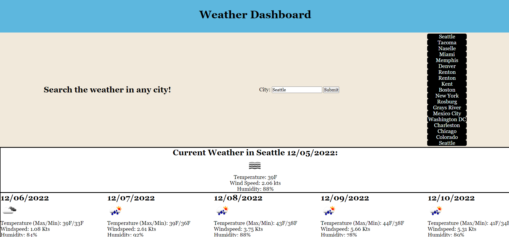

# Weather Dashboard

## Link to deployed website: https://wasmulb.github.io/weather-dash

## Description

For this assignment, I developed a simple weather application. With this website, the user can search any city and the website will retrieve a current forecast as well as a five-day forecast. The API used for this was from openweathermap.org. The application also stores and displays the users previously searched cities by using local storage. 

I learned a lot from developing this website. I got familiar with making server calls to retrieve the data I want. I had no major issues when dealing with the API. The API documentation was clear and helpful.

My biggest obstacle in this assignment was getting the weather icons to display correctly, but I got it working after learning that I can add attributes to created elements with "setAttribute("src", {URL})"

## Usage

Using this application is very simple. All the user needs to do is enter the desired city in the text input and click submit. The city they just searched for will be displayed to the right, where the user can click again to get the forecast for the city again.

## License

The MIT Licsense was used for this assignment.